# Dissertation: Connected Seat System
## Introduction: 
Smart Connected Seats serve as a helpful guide in public places like libraries and teaching theatres, assisting people in finding available and suitable seating. The Smart Connected Seats system combines a sensor-enabled chair and data communication centre. Every chair includes a millimetre-wave radar, to detect if someone is sitting down, along with sensors for carbon dioxide, temperature, humidity and light, to monitor the surrounding environment to ensure comfort. The communication centre visualises the data from the sensors. It includes model of the chairs, which rise when someone sits on real chairs, and an e-ink display to communicate the environmental conditions. 

## Hypothesis: 
How can a smart connected seat system using millimeter-wave radar and various environmental sensors help people to find a seat with better learning or working experience.

## Aims:
This project aims to implementing a smart Internet of Things (IoT) strategy on chairs, in order to transform the way we interact with these spaces

## Methodologies:
The Smart Connected System includes smart chair detector equipped with few sensors and physical twins of chair.

Project Overview:

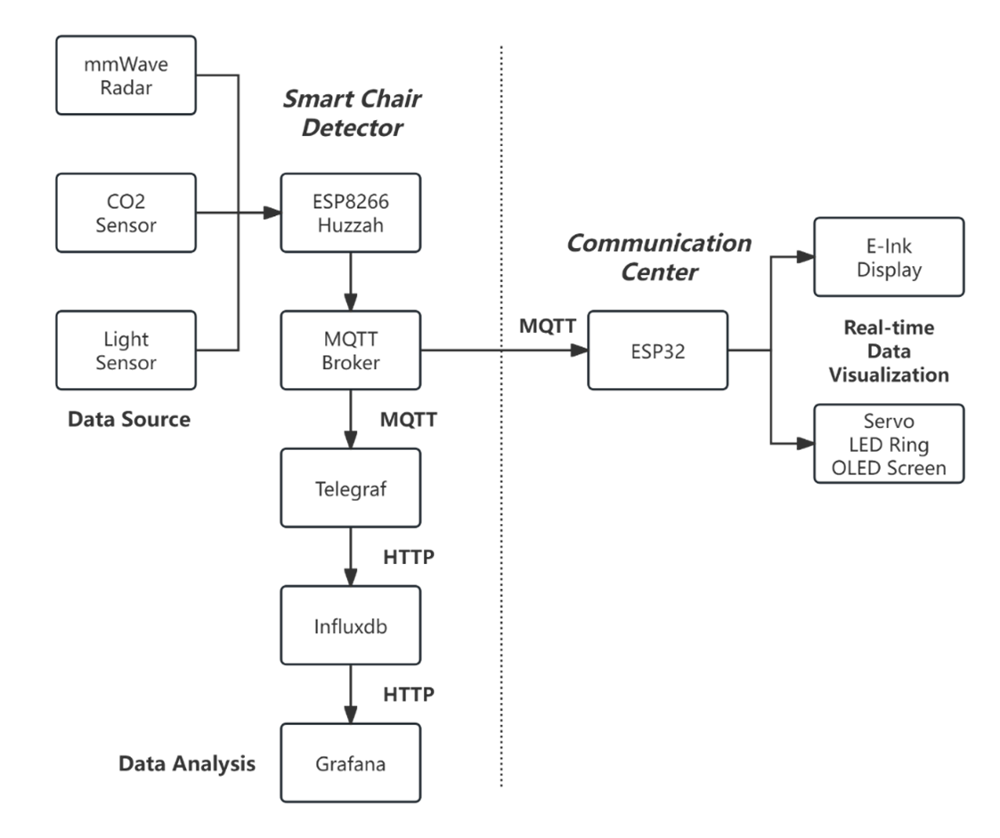

### Hardware:

#### Hardware List:

##### 1. Microcontrollers:
ESP8266 HUZZAH (Smart Chair Detector)
ESP32 E-paper screen driver board (Communication Center)

##### 2. Sensors:
This project use mm-Wave radar SEN0395, CO2, temperature and humidity sensor SCD30, and light sensor TCS3472. Use the code provided to test each sensor before integration.

SEN0395:

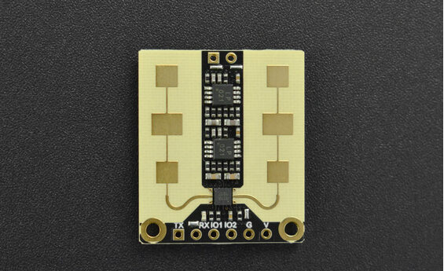

SCD30:

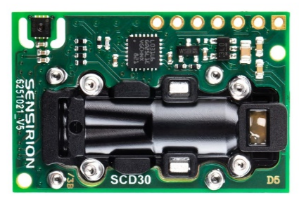

TCS3472:

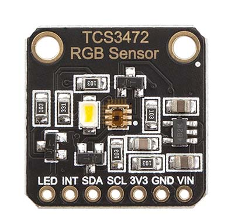

##### 3. Actuators:
Actuators are mainly used in communication center, they are: servos, LED rings and OLED screens.

#### Circuit:
##### Circuit Connection:
Connect all the sensor as the schematic shown as below:

Smart chair detector circuit schematic:

Communication center circuit schematic:

It worth noting that when connect two OLED screens to circuit, physical address of one of them should be changed by soldering the resister behind the screen (shown as picture below) to another position for another address, otherwise the microcontroller is not able to recognise these two screens. It has two physical address； 0x78 and 0x7A，and 0x78 is the default one.

0x78；

0x7A:(manually modification needed)

After successfully assembling the circuit board and connecting all components, test the circuit functions in Arduino IDE by uploding the code provided to the microcontroller.

Code for smart chair detector:

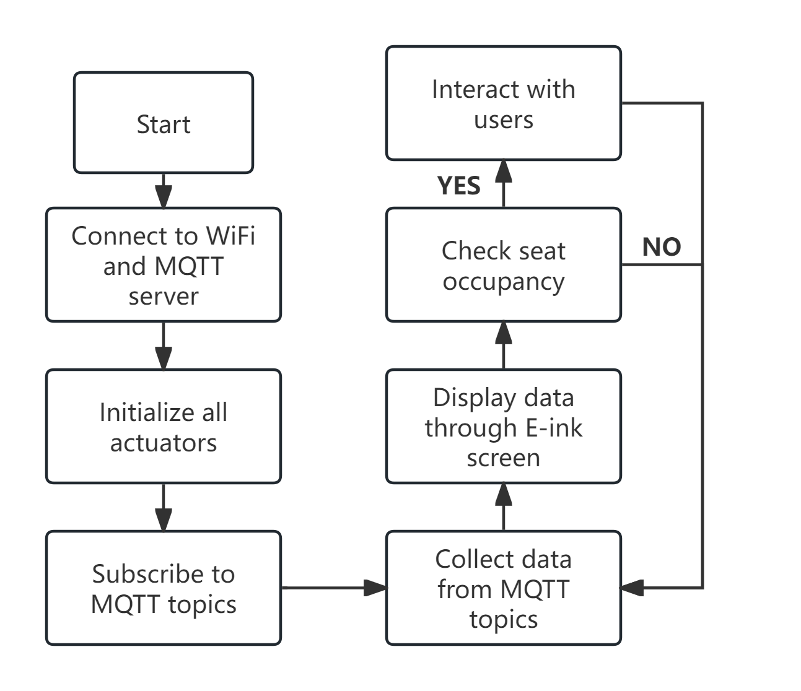

Code for communication center:

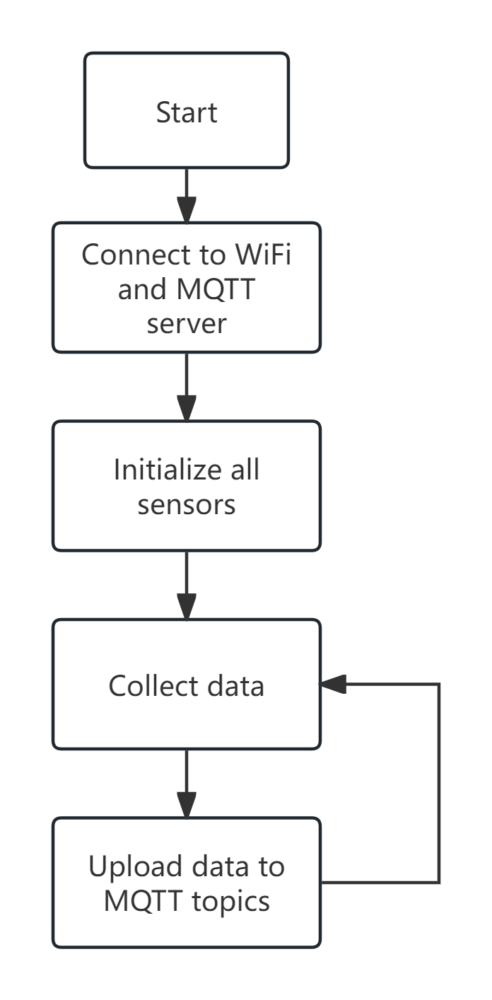

##### Printed Circuit Board (PCB)
PCB has been designed for ensuring a more stable and wireless circuit. You can build your own PCB or modified mine which I designed on LCEDA according to your project.

#### Enclosure：
Custom-designed enclosures were developed for the circuit boards, sensors and actuators to facilitate their deployment in targeted scenarios. You can build your own enclosure or modified mine on Fusion 360 according to your project.

Smart Chair Detector Enclosure:

Base of Communication Center:

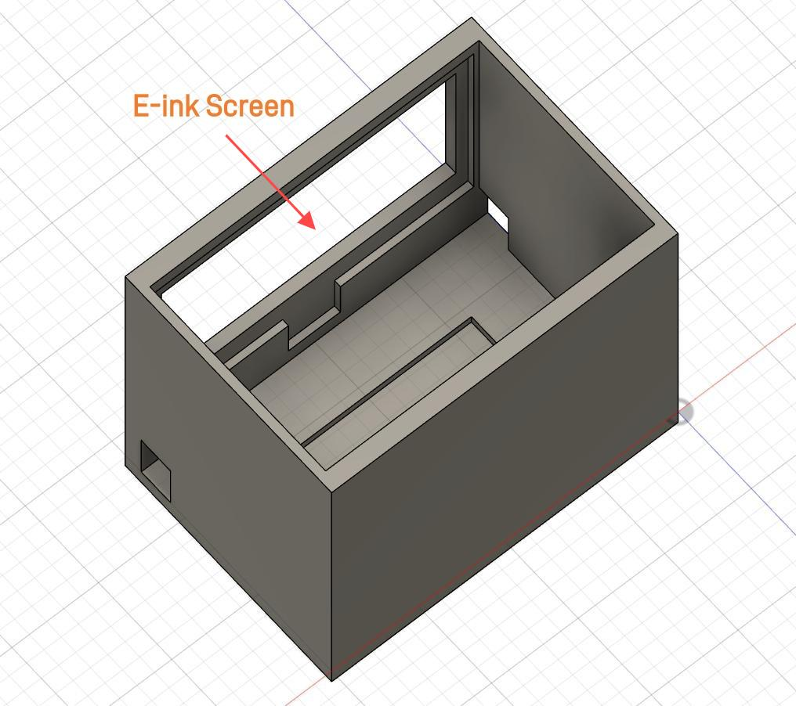

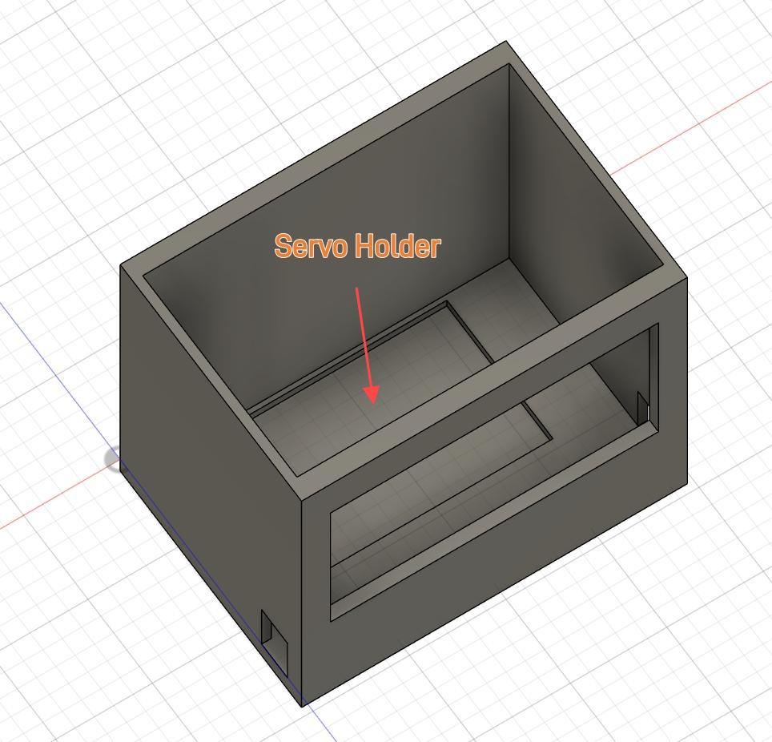

Servo Holder:

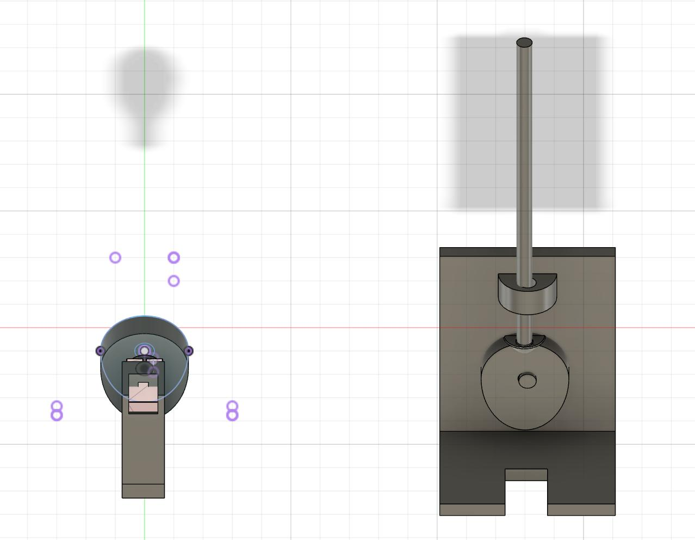

Top of Communication Center

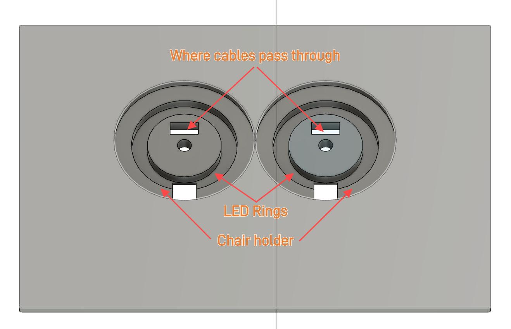

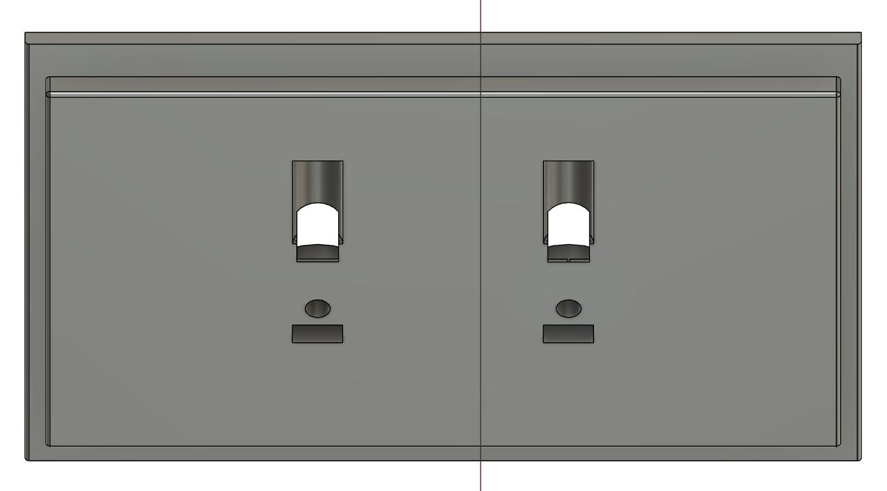

Chair Holder:

Chair:

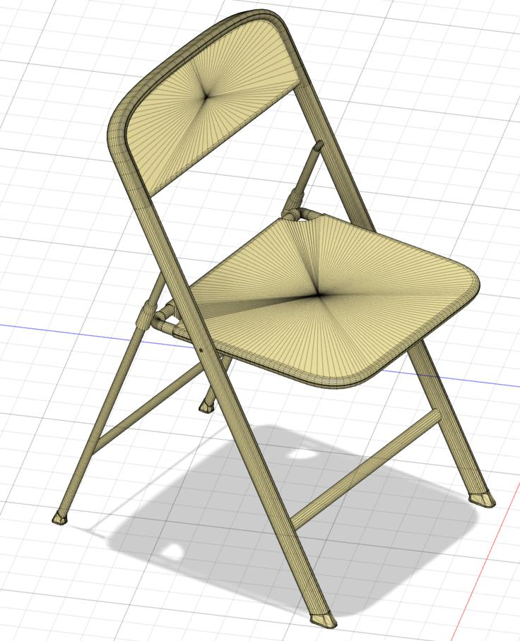

## Result:

Smart Chair Detector:

Deployment:

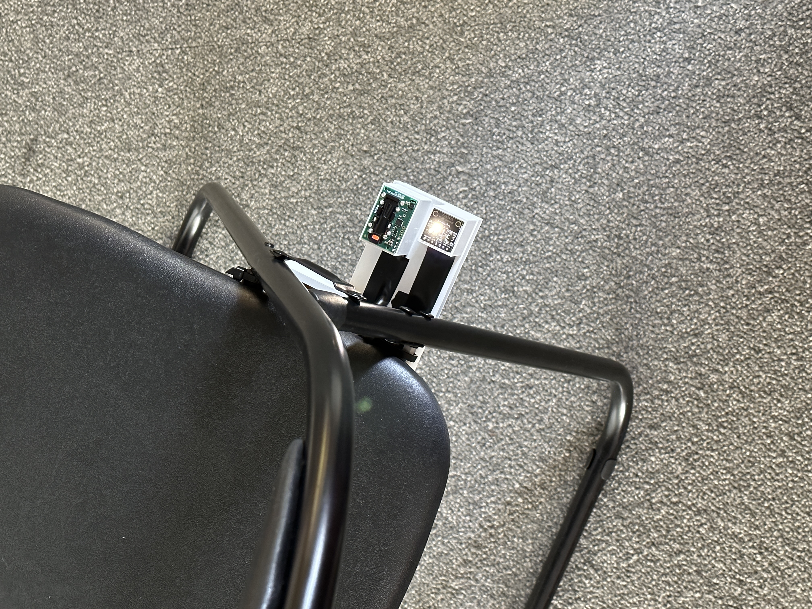 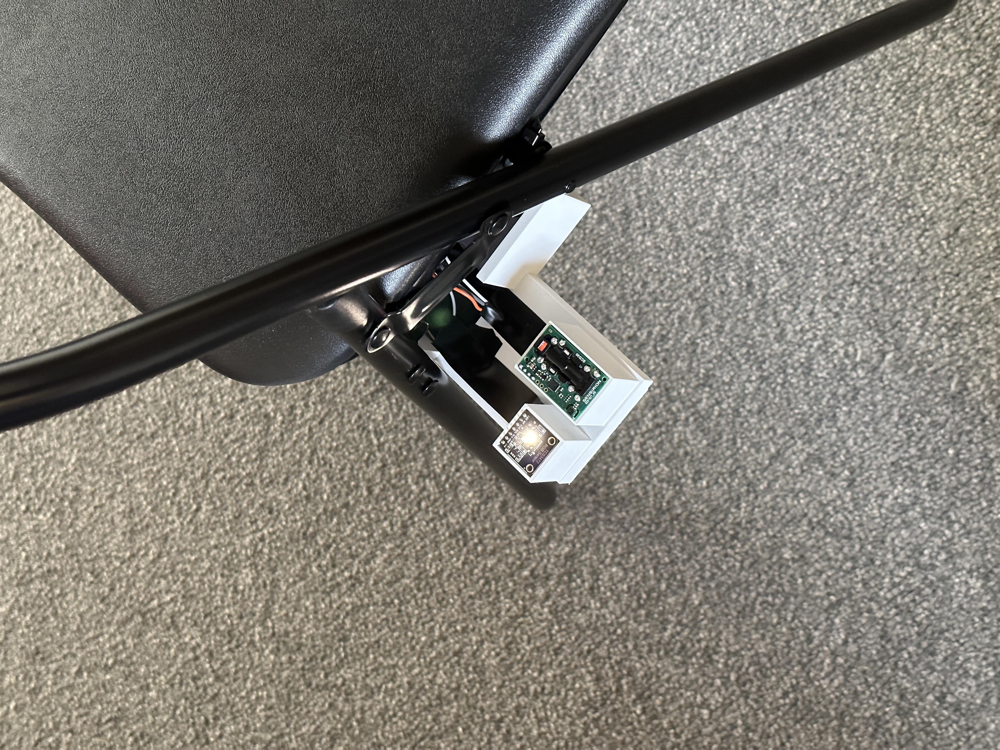

Communication Center:

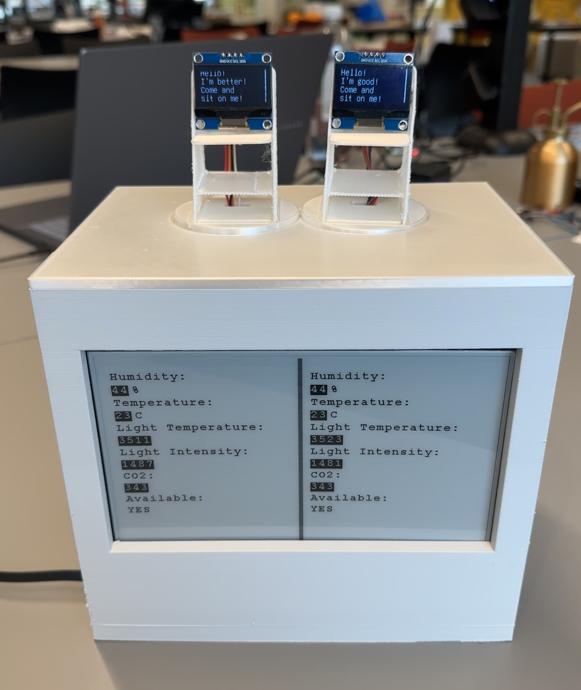

When people sit on one of the chair:

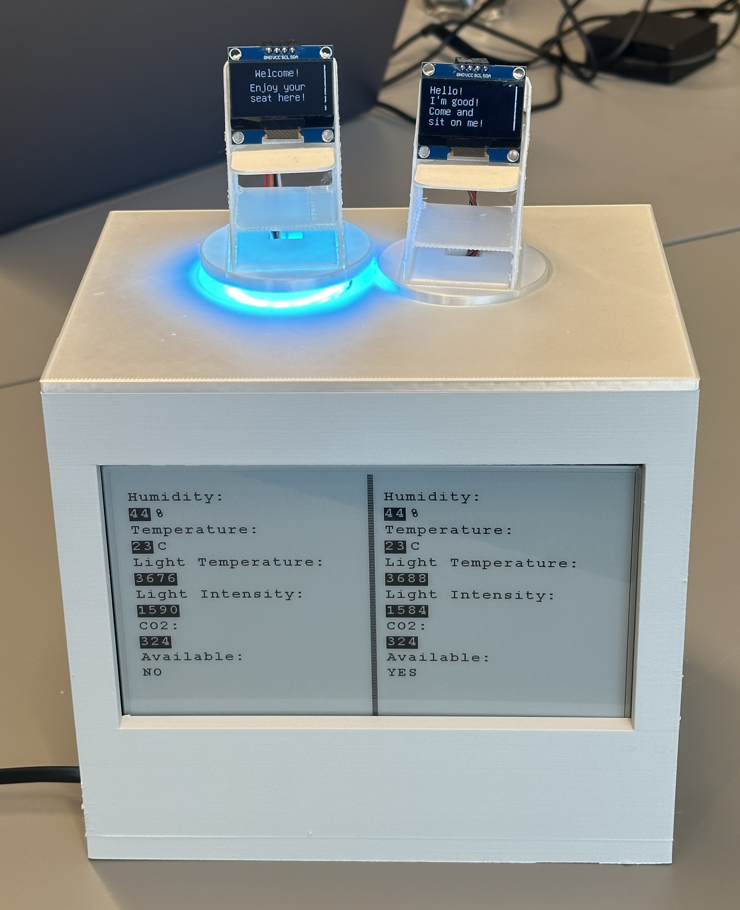

## Steps for recreation:

1. Prepare the hardware needed.

2. Connect all the components and test the functions by code. Remember to replace the key information for WiFi and MQTT broker with your own one.

3. Design your PCB (optional) and Enclosure or modified mine according to your own requirement.

4. Assemble all the electronic components and enclosure.

5. Run the code and deploy on your chair
